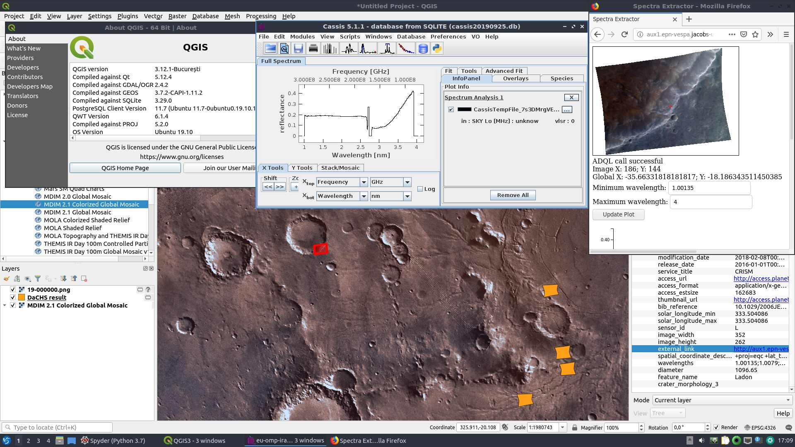

# VO_QGIS_plugin
WIP Release of QGIS plugin providing interface to VESPA - QGIS-3.0+ compatible

## Description
This repository is a fork of https://github.com/epn-vespa/VO_QGIS_plugin.

Since the original plugin is compatible only with QGIS 2.x, this is a work in progress attempt to convert it to Python 3.0+ and grant compatibility with QGIS 3.x

Clone/copy containing folders to your .qgis2/python/plugins directory.

Plugin "VESPA" allows for running SAMP HUB and SAMP Client from within QGIS. It accepts VOTables sent from other applications, provided they contain s_region field in correct notation ("Polygon UNKNOWNFrame 1 1 1 1 ...") and saves these as SpatiaLite in temporary folder, then loads it as polygon feature layer into QGIS.

Plugin "GAVOImage" uses thumbnail_url and a few other EPN-TAP2.0 standard fields to load a tumbnail image onto the canvas also georeferencing it over the polygon. At present it can only load one image at a time. This "GAVOImage" plugin has been tested on CRISM table available from epn1.epn-vespa.jacobs-university.de. In combination with WMS layers exposed on the same server this is a nice tool for planetary exploration.

Plugin "polyToAladin" uses s_region field of selected features (can select more than one) to send them via SAMP to Aladin.

## Prerequisites:
PyQt5
os
qgis
astropy
pyshp (module shapefile)
numpy
tempfile
geojson
urllib
threading
time

## Screenshot
Tested on Lubuntu 19.10, Python 3.7

